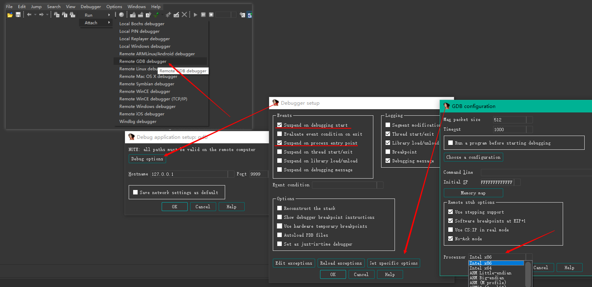

# Qiling Gdbserver

Qiling supports **GDB remote debugging**, it will work with gdbserver compatible clients (e.g., IDApro). Currently, Qiling's gdbserver is not as complete as GDB's gdbserver, however we are very close to qemu-gdbserver. There are still some manual steps required for more comprehensive debugging (e.g., manually rebase the base address in IDAPro) 

### Turning on gdbserver

```python
from qiling import *

def test_gdb(path, rootfs):
    ql = Qiling(path, rootfs, output="off")

    # Enable debugger to listen at localhost address, default port 9999
    ql.debugger = True

    # You can also customize address & port or type of debugging server
    # ql.debugger= ":9999"  # GDB server listens to 0.0.0.0:9999
    # ql.debugger = "127.0.0.1:9999"  # GDB server listens to 127.0.0.1:9999
    # ql.debugger = "gdb:127.0.0.1:9999"  # GDB server listens to 127.0.0.1:9999
    # ql.debugger = "idapro:127.0.0.1:9999"  # IDA pro server listens to 127.0.0.1:9999

    ql.run()  

if __name__ == "__main__":
    test_gdb(["../examples/rootfs/x8664_linux/bin/x8664_hello_static"], "../examples/rootfs/x8664_linux")
```

By default, gdbserver listens on **localhost**, port **9999** and emulated code will pause at entrypoint.

---

### Debug with IDA

Only tested on IDAPro 7.4

1. Run Qiling code, with gdbserver enable, as shown in the sample script above.
2. Configure IDAPro like below



3. Make sure to select the correct architecture of target code
4. Make sure you rebase your code so breakpoint will work

---

### Debug with GDB

**set arch**
```bash
(gdb) set architecture i386:x86-64
The target architecture is assumed to be i386:x86-64
```

**connect**
```bash
(gdb) target remote localhost:9999
Remote debugging using localhost:9999
warning: No executable has been specified and target does not support
determining executable automatically.  Try using the "file" command.
0x00000000004014e0 in ?? ()
```
**next/step**

```bash
(gdb) disas 0x00000000004014e0,0x00000000004014ff
Dump of assembler code from 0x4014e0 to 0x4014ff:
=> 0x00000000004014e0:  sub    $0x28,%rsp
   0x00000000004014e4:  mov    0x2f55(%rip),%rax        # 0x404440
   0x00000000004014eb:  movl   $0x0,(%rax)
   0x00000000004014f1:  callq  0x401640
   0x00000000004014f6:  callq  0x401180
   0x00000000004014fb:  nop
   0x00000000004014fc:  nop
   0x00000000004014fd:  add    $0x28,%rsp
End of assembler dump.
(gdb) ni
0x00000000004014e4 in ?? ()
(gdb)
0x00000000004014eb in ?? ()
(gdb)
0x00000000004014f1 in ?? ()
(gdb) si
0x0000000000401640 in ?? ()
(gdb) disas 0x0000000000401640,0x000000000040164f
Dump of assembler code from 0x401640 to 0x40164f:
=> 0x0000000000401640:  push   %r12
   0x0000000000401642:  push   %rbp
   0x0000000000401643:  push   %rdi
   0x0000000000401644:  push   %rsi
   0x0000000000401645:  push   %rbx
   0x0000000000401646:  sub    $0x30,%rsp
   0x000000000040164a:  mov    0x1a5f(%rip),%rbx        # 0x4030b0
End of assembler dump.
```

**add/remove breakpoint**
```bash
(gdb) break *0x0000000000401645
Breakpoint 1 at 0x401645
(gdb) i b
Num     Type           Disp Enb Address            What
1       breakpoint     keep y   0x0000000000401645
(gdb) c
Continuing.

Breakpoint 1, 0x0000000000401645 in ?? ()
(gdb) del 1
(gdb) i b
No breakpoints or watchpoints.
```

**read register/memory**
```bash
(gdb) i r
rax            0x407610            4224528
rbx            0x0                 0
rcx            0x0                 0
rdx            0x0                 0
rsi            0x0                 0
rdi            0x0                 0
rbp            0x80000001d000      0x80000001d000
rsp            0x80000001cfb0      0x80000001cfb0
r8             0x0                 0
r9             0x0                 0
r10            0x0                 0
r11            0x0                 0
r12            0x0                 0
r13            0x0                 0
r14            0x0                 0
r15            0x0                 0
rip            0x401645            0x401645
eflags         0x14                [ PF AF ]
cs             0x0                 0
ss             0x0                 0
ds             0x0                 0
es             0x0                 0
fs             0x0                 0
gs             0x0                 0
x/10xg
(gdb) x/10xg 0x0000000000401645
0x401645:       0x1d8b4830ec834853      0xa232b84800001a5f
0x401655:       0x394800002b992ddf      0x0000202444c748c3
0x401665:       0x48d3f74817740000      0x834800001a4d1d89
0x401675:       0x5c415d5f5e5b30c4      0x20244c8d489066c3
0x401685:       0x8b4800006b8115ff      0x006b5615ff202474
```

---

### Todo

1. Add support for more architectures
2. Added support for more GDB commands
3. Make it similar to GDB gdbserver

---

## Credits

- Inspired by ideas from [uDdbg](https://github.com/iGio90/uDdbg)

