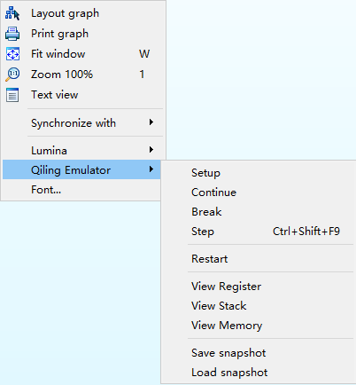
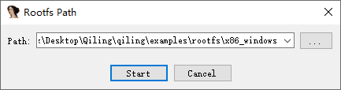
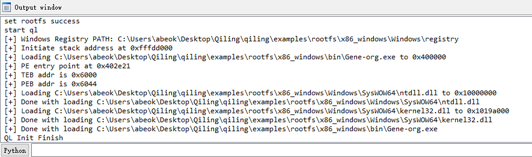
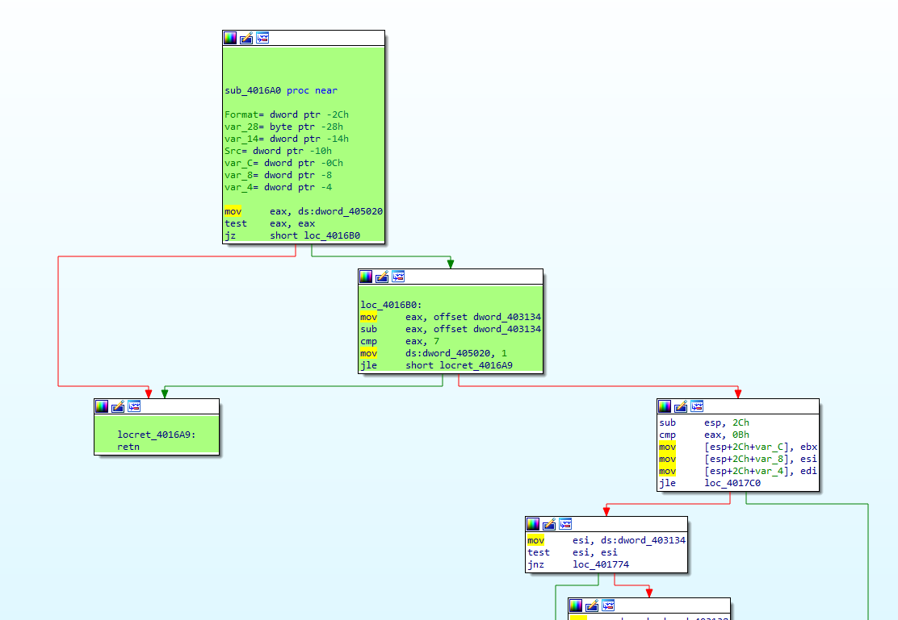
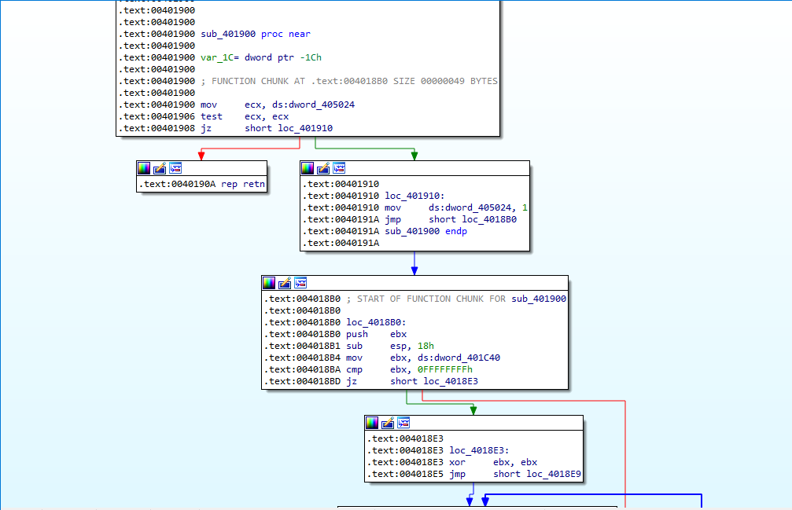
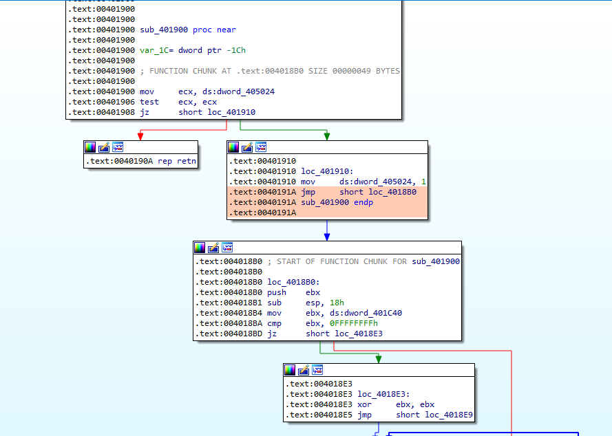
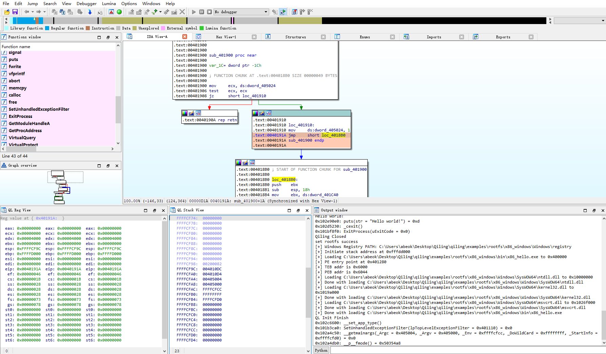
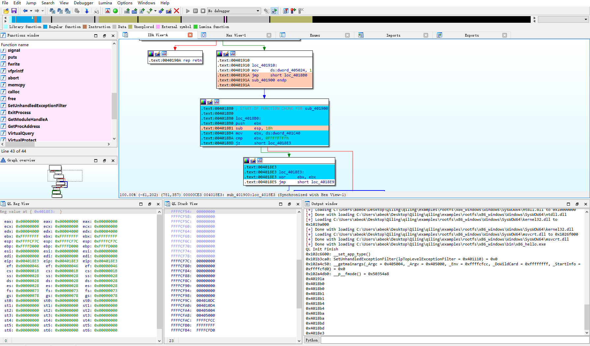
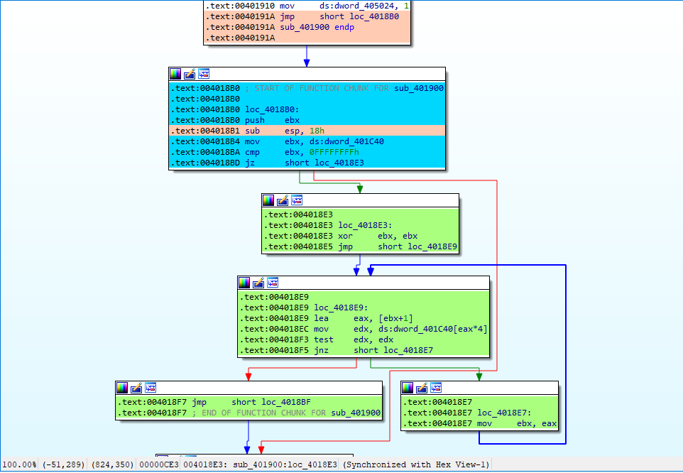
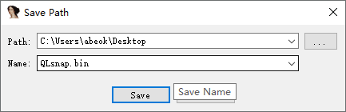

# Qiling Emulator Plugin For IDA Guide
Author: kabeor
## Install
There are Two ways to install Qiling Emulator
> 1. open plugin file, change `UseAsScript = False`. Put the plugin file in IDA Pro\plugins and open IDA, it will auto load.
> 2. open plugin file, change `UseAsScript = True`. Open IDA, Click `File/Script file...`, choose plugin file, it will load.

This plugin support IDA7.x

## Usage
After load the plugin, click on the right will show Qiling Emulator popmenu

### Emulate

**Must Click Setup First**
select rootfs path and click Start

Now if you click `Continue`, Qiling will emulate the target from start(entry_point) to finish(exit_point) and paint the path green.

if you want to start over, click `Restart`, it will clear the previous color and ask rootfs path again, then we back to the start.

Now try something new, we want to let Qiling stop at 0x40191A.

Just move the mouse pointer to position 0x40191A and click right, select Break, Qiling will emulate to 0x40191A(if the path is reachable), and paint the address nude.

we can watch Register and Stack by click `View Register`, `View Stack`.

Click `Step` or use `CTRL+SHIFT+F9` can let Qiling emulator step in and paint the path blue. 

**You can see 'Register view' and 'Stack view' are real-time**

Now we are in 0x4018E3. If you want to continue from 0x4018E3, just click `Continue`, it will emulate until program exit and paint the path green.

### Save/Load
you can save current status(Register, Memory, CPU Context) and load it to your Qiling emulate script or new Qiling Emulator Plugin, just click `Save Snapshot`
or `Load Snapshot`.

For saving, you should select the path where you want to store and file name.

For restoring, you should select where the status saving file is.

